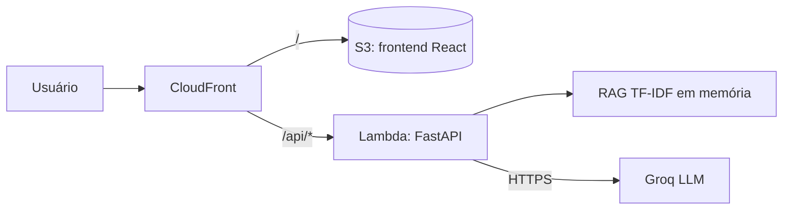

# Assistente Diversa — Educação Inclusiva

Chatbot RAG sobre Educação Inclusiva, com base nos artigos do [Portal Diversa](https://diversa.org.br/). Projeto de TCC da **Equipe Hélice** (SoulCode Academy / Accenture).

A versão web separa o protótipo original (notebook com Gradio) em uma API FastAPI e uma interface React. O notebook continua em [notebooks/](notebooks/README.md).

## Arquitetura



Fluxo de `POST /api/chat`: valida a entrada, checa o escopo (fora do tema, responde com redirecionamento), busca os artigos, monta o prompt do perfil, chama a Groq e pós-processa a resposta. Sem chave da Groq, ou se ela falhar, a API responde em modo demonstração.

| Método | Rota | Função |
|---|---|---|
| GET | `/api/health` | Status e total de artigos indexados |
| GET | `/api/profiles` | Perfis, saudações e perguntas sugeridas |
| POST | `/api/chat` | `{pergunta, perfil, historico}` → `{resposta, perfil, fontes, origem}` |

Não há banco de dados na V1: os artigos ficam em `backend/app/data/artigos.csv`, o histórico fica no navegador (`localStorage`) e cada interação é registrada como uma linha JSON no log.

## Estrutura

```
backend/    API FastAPI (app/api, core, services, repositories, schemas, data) e testes
frontend/   React + Vite + TypeScript
infra/      template SAM (Lambda, S3, CloudFront, Budget) e deploy.sh
notebooks/  protótipo original em Gradio
```

## Rodar localmente

Configure a chave da Groq copiando `.env.example` para `.env` na raiz (`GROQ_KEY=...`). Ela é opcional.

```bash
# API em http://localhost:8000
cd backend
python3 -m venv .venv && .venv/bin/pip install -r requirements-dev.txt
.venv/bin/uvicorn app.main:app --reload --port 8000

# Interface em http://localhost:5173 (em outro terminal)
cd frontend
npm install && npm run dev
```

Testes do backend: `cd backend && .venv/bin/pytest`.

### Com Docker

```bash
docker compose up --build   # interface em http://localhost:5173, API em http://localhost:8000
```

O código do `backend/app` e do `frontend/` é montado nos contêineres: ao salvar um arquivo, o `uvicorn --reload` reinicia a API e o Vite atualiza o navegador. A chave da Groq vem do `.env` da raiz. Se mudar dependências (`requirements.txt` ou `package.json`), rode de novo com `--build`.

Para testar a versão de produção (frontend compilado servido pelo nginx, que encaminha `/api/` para a API, como o CloudFront faz na AWS):

```bash
docker compose -f docker-compose.prod.yml up --build   # http://localhost:8080
```

## Configuração do backend

Variáveis de ambiente (ou `.env`):

| Variável | Padrão | Uso |
|---|---|---|
| `GROQ_KEY` | vazio | Chave da Groq (também aceita `GROQ_API_KEY`) |
| `GROQ_MODEL` | `openai/gpt-oss-20b` | Modelo usado |
| `CORS_ORIGINS` | `http://localhost:5173` | Origens permitidas, separadas por vírgula |
| `RATE_LIMIT_POR_MINUTO` | `20` | Requisições por IP em `/api/chat` |
| `MAX_CHARS_PERGUNTA` | `1000` | Tamanho máximo da pergunta |

## Deploy na AWS

Pré-requisitos: AWS CLI, SAM CLI e Docker. Crie a conta no **Free account plan**, que não cobra enquanto você não fizer upgrade.

```bash
ALERT_EMAIL=voce@exemplo.com GROQ_KEY=... ./infra/deploy.sh
```

Proteções contra custo:

- A concorrência da Lambda é limitada (`ConcorrenciaMaxima`, padrão 3), o que limita o uso e o custo.
- Um Budget avisa por e-mail quando o custo bruto passa de US$ 0,10 e aciona uma Lambda que coloca a concorrência da API em 0, o que desliga a API.
- Para religar, rode o deploy de novo.
- Os dados de custo da AWS têm atraso de horas, então o desligamento não é instantâneo.
