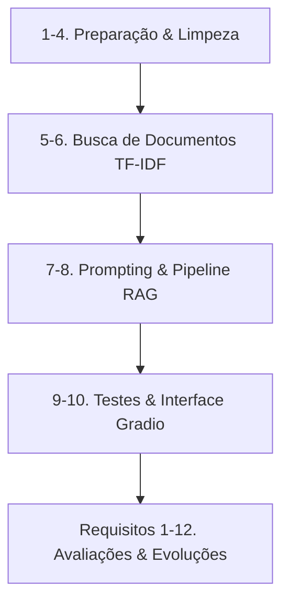

# 🌐 Assistente Diversa — Educação Inclusiva

Protótipo funcional desenvolvido para o Trabalho de Conclusão de Curso (TCC) da **Equipe Hélice (SoulCode Academy / Accenture)**.

O **Assistente Diversa** é um chatbot especializado em **Educação Inclusiva**, alimentado por uma base de dados curada com artigos do [Portal Diversa](https://diversa.org.br/). Ele utiliza arquitetura **RAG (Retrieval-Augmented Generation)**: realiza buscas híbridas de documentos relevantes com TF-IDF e gera respostas adaptadas ao perfil do usuário final por meio de grandes modelos de linguagem (LLMs) via API da **Groq** (Llama 3.1).

---

## Arquitetura web em camadas (Flutter + FastAPI + PostgreSQL)

O projeto separa as responsabilidades em `frontend/`, `backend/` e `database/`. O Flutter é organizado por feature nas camadas `data`, `domain` e `presentation`; o backend contém entidades, casos de uso, repositórios, rotas e schemas Pydantic; e o banco mantém o catálogo de artigos e uma coluna vetorial preparada para busca futura. As respostas continuam mockadas nesta etapa.

### Executar a integração local com Docker

Requer Docker Engine e Docker Compose. Na raiz do repositório:

```bash
cp .env.example .env
# Troque POSTGRES_PASSWORD e POSTGRES_APP_PASSWORD por senhas locais fortes.
docker compose up --build
```

Abra `http://localhost:8080`. A API fica disponível pelo proxy do frontend em `/api/v1` e a documentação OpenAPI em `http://localhost:8080/docs`. O catálogo inicial vem de `backend/app/data/articles.json`; `database/init/` cria o schema, habilita `pgvector` e insere os dados mockados no volume PostgreSQL. O backend acessa o banco com um usuário local somente de leitura. Para encerrar, use `docker compose down`; **`docker compose down -v` apaga o banco local**.

Para rodar o backend fora dos containers, instale `backend/requirements-dev.txt` e execute `uvicorn app.main:app --reload` dentro de `backend/`. Sem `DATABASE_HOST`, a API usa o repositório JSON para desenvolvimento e testes. Os endpoints são `GET /health`, `GET /api/v1/articles` e `POST /api/v1/chat`.

### Imagens e implantação

Cada camada tem seu `Dockerfile`: `frontend/Dockerfile` compila o Flutter web e serve os arquivos por Nginx não-root; `backend/Dockerfile` instala e inicia a API como usuário não-root; `database/Dockerfile` prepara PostgreSQL 16 com `pgvector` para desenvolvimento local. O `compose.yaml` é a integração local, com rede privada entre containers, volume persistente, health checks e portas locais.

Para publicar, construa e envie as imagens do frontend/backend a um registry e execute-as em uma plataforma de containers (por exemplo, ECS). Configure o frontend para alcançar o serviço backend pelo DNS privado da plataforma; coloque TLS e entrada pública num Application Load Balancer/WAF, não exponha diretamente PostgreSQL. Ajuste CORS para a origem real e injete os segredos pelo Secrets Manager/gerenciador de segredos da plataforma, nunca na imagem ou no repositório.

### Banco gerenciado na AWS

`infrastructure/aws/database/` contém Terraform para provisionar Amazon RDS for PostgreSQL em sub-redes privadas existentes: criptografia em repouso, Multi-AZ, backups automáticos por sete dias, proteção contra exclusão, senha administrativa gerenciada pelo Secrets Manager, logs com retenção definida e regra de entrada limitada ao security group do backend. O banco não é público. Os valores de região, versão PostgreSQL compatível com `pgvector`, classe de instância, VPC, sub-redes e security group são entradas obrigatórias para dimensionar a implantação ao ambiente. Antes do `terraform init`, crie um bucket S3 remoto com versionamento, criptografia e bloqueio de acesso público; configure o backend com esse bucket, chave exclusiva e região (`use_lockfile=true`). Não compartilhe `tfstate` nem aplique alterações sem revisar `terraform plan`. A proteção `prevent_destroy` exige uma alteração deliberada e revisada para remover o banco.

O output `master_secret_arn` aponta para a credencial administrativa; **não use essa conta na API**. Execute as migrações versionadas de `database/init/` por um job controlado de implantação, crie/rotacione um usuário separado com apenas leitura na tabela `articles` e entregue suas credenciais à API via Secrets Manager. Para AWS, configure `DATABASE_HOST`, `DATABASE_NAME`, `DATABASE_USER`, `DATABASE_PASSWORD`, `DATABASE_SSLMODE=verify-full` e monte o bundle de certificados CA do RDS no container indicando `DATABASE_SSLROOTCERT`. RDS tem custo contínuo (especialmente Multi-AZ); escolha região e classe após estimar carga, orçamento, RPO/RTO e requisitos de disponibilidade. O protótipo não cria conta/VPC, deploy de ECS, domínio/TLS ou pipeline de migração automaticamente.

---

## 🚀 Como Executar o Projeto (Guia Rápido)

Siga o passo a passo para rodar o protótipo localmente:

### 1. Preparar o Ambiente
Abra o terminal na pasta raiz do projeto:
```bash
# Crie o ambiente virtual
python3 -m venv venv

# Ative o ambiente virtual
# No Linux/macOS:
source venv/bin/activate
# No Windows (Command Prompt):
venv\Scripts\activate

# Instale as dependências
pip install -r requirements.txt
```

### 2. Configurar as Chaves de API (`.env`)
O assistente requer uma chave da Groq para habilitar a geração por IA (sem ela, rodará em modo demonstração estático).
1. Obtenha sua chave gratuita no console da [Groq](https://console.groq.com/) e [HuggingFace](https://huggingface.co/)
2. Crie ou edite o arquivo `.env` na raiz do projeto e insira:
```env
GROQ_KEY=sua_chave_aqui
HUGGINGFACE_API_KEY=sua_chave_aqui
```

### 3. Rodar o Notebook
Com o ambiente ativado, inicie o Jupyter:
```bash
jupyter notebook
```
No navegador, abra `prototipo_funcional_assistente_diversa.ipynb` e execute todas as células (`Cell -> Run All` ou `Shift + Enter` sequencialmente). O link da interface web interativa do **Gradio** será exibido na célula correspondente (`http://127.0.0.1:7860`).

---

## 📂 Arquitetura do Notebook

O arquivo `prototipo_funcional_assistente_diversa.ipynb` está estruturado de forma lógica e incremental nas seguintes etapas:


### 📋 Requisitos do Projeto (1 a 12)

A evolução do protótipo é guiada por 12 requisitos organizados e avaliados no notebook:

1. **Requisito 1: Expansão da Base de Conhecimento**
   * Ampliação do corpus para mais de 20 artigos do Portal Diversa, englobando temas como autismo (TEA), TDAH, deficiência visual, auditiva, intelectual, tecnologia assistiva, AEE e legislação.
2. **Requisito 2: Controle de Anti-Alucinação**
   * Configuração de diretivas no prompt de sistema para proibir a invenção de títulos de artigos e links (URLs), reforçando que o modelo se limite aos trechos recuperados.
3. **Requisito 3: Bateria de Testes Automatizada**
   * Criação e documentação de um conjunto de testes estruturado avaliando respostas corretas, redirecionamentos de escopo e possíveis falhas.
4. **Requisito 4: Avaliação de Ética e Riscos**
   * Análise de conformidade ética, limitações do assistente em produção e mitigação de riscos em ambiente pedagógico real.
5. **Requisito 5: Escolha e Configuração do Modelo**
   * Justificativa da escolha do modelo (`llama-3.1-8b-instant` ou equivalentes), limites de requisições gratuitas (Rate Limits) e controle de erros.
6. **Requisito 6: Estilização da Interface de Usuário**
   * Implementação visual da interface com folhas de estilo personalizadas (CSS) e referências visuais da Equipe Hélice.
7. **Requisito 7: Parametrização por Perfil de Usuário**
   * Personalização de respostas (temperatura, limites de tokens) de acordo com o perfil selecionado (Professor, Família, Gestor).
8. **Requisito 8: Controles Dinâmicos no Gradio**
   * Utilização de elementos de interface como dropdowns, botões e controles de seleção de perfil.
9. **Requisito 9: Histórico e Persistência de Conversação**
   * Implementação de histórico persistente e controle de contexto isolado por perfil do usuário durante a sessão.
10. **Requisito 10: Métricas de Uso e Dashboards**
    * Registro em tempo real de logs (`timestamp`, `perfil`, `pergunta`, `titulo_artigo`, `artigos_recuperados`, `score_similaridade`) e visualização via Boxplot e tabelas analíticas.
11. **Requisito 11: Busca Semântica Avançada (Embeddings)**
    * Implementação de vetorização semântica usando embeddings multilíngues via API do HuggingFace para suporte a sinônimos.
12. **Requisito 12: Benchmark de Modelos e Fallback**
    * Testes de performance comparativos de latência e qualidade entre modelos da Groq.

---

## 🛠️ Recursos Adicionais
* **`style.css`**: Folha de estilo CSS utilizada para a customização estética premium da interface Gradio.
* **`imagens_do_tcc/`**: Contém elementos gráficos essenciais do chat, como o cordão de quebra-cabeça (TEA) e ícones da Equipe Hélice.
* **`artigos.csv`**: Base de conhecimento estruturada do Portal Diversa.
