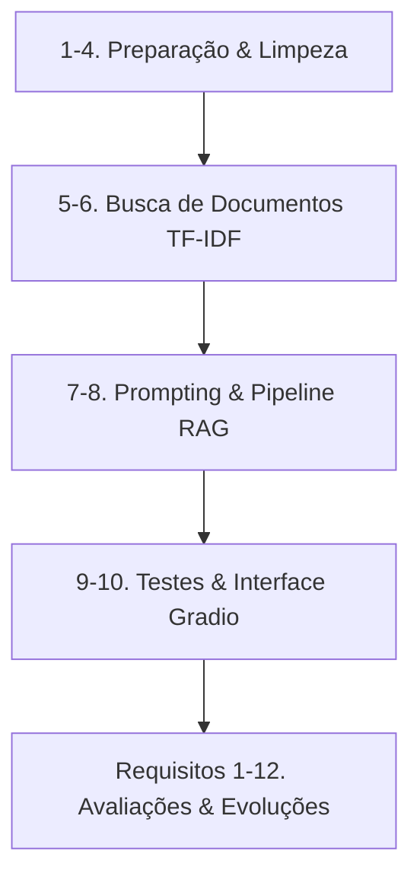

# 🌐 Assistente Diversa — Educação Inclusiva

Protótipo funcional desenvolvido para o Trabalho de Conclusão de Curso (TCC) da **Equipe Hélice (SoulCode Academy / Accenture)**.

O **Assistente Diversa** é um chatbot especializado em **Educação Inclusiva**, alimentado por uma base de dados curada com artigos do [Portal Diversa](https://diversa.org.br/). Ele utiliza arquitetura **RAG (Retrieval-Augmented Generation)**: realiza buscas híbridas de documentos relevantes com TF-IDF e gera respostas adaptadas ao perfil do usuário final por meio de grandes modelos de linguagem (LLMs) via API da **Groq** (Llama 3.1).

---

## Protótipo web em camadas (FastAPI + Flutter)

O diretório `backend/` contém a API FastAPI com catálogo JSON estático e respostas determinísticas mockadas. O diretório `frontend/` contém o app Flutter organizado por feature nas camadas `data`, `domain` e `presentation`. O frontend só envia mensagens e exibe a resposta e as fontes; configuração, validação dos dados e seleção de fontes ficam no backend. Esta etapa serve para validar a integração e não substitui o notebook nem usa LLM ou banco vetorial.

### Executar o backend

```bash
cd backend
python -m venv .venv
source .venv/bin/activate
pip install -r requirements-dev.txt
uvicorn app.main:app --reload
```

A API e a documentação interativa ficam em `http://localhost:8000` e `http://localhost:8000/docs`. O catálogo está em `backend/app/data/articles.json`; os principais endpoints são `GET /health`, `GET /api/v1/articles` e `POST /api/v1/chat`.

### Executar o Flutter web

Com Flutter instalado, em outro terminal:

```bash
cd frontend
flutter pub get
flutter run -d chrome --dart-define=API_BASE_URL=http://localhost:8000
```

Para testar em um emulador Android, defina `API_BASE_URL=http://10.0.2.2:8000`; em dispositivo físico, use o endereço IP acessível da máquina que executa a API.

### Validar a integração

Com o backend ativo, envie uma pergunta pelo app (por exemplo, “Como apoiar um estudante autista?”). A resposta e a fonte retornadas devem corresponder ao perfil selecionado. A suíte de API pode ser executada com `cd backend && pytest`.

---

## 🚀 Como Executar o Projeto (Guia Rápido)

Siga o passo a passo para rodar o protótipo localmente:

### 1. Preparar o Ambiente
Abra o terminal na pasta raiz do projeto:
```bash
# Crie o ambiente virtual
python3 -m venv venv

# Ative o ambiente virtual
# No Linux/macOS:
source venv/bin/activate
# No Windows (Command Prompt):
venv\Scripts\activate

# Instale as dependências
pip install -r requirements.txt
```

### 2. Configurar as Chaves de API (`.env`)
O assistente requer uma chave da Groq para habilitar a geração por IA (sem ela, rodará em modo demonstração estático).
1. Obtenha sua chave gratuita no console da [Groq](https://console.groq.com/) e [HuggingFace](https://huggingface.co/)
2. Crie ou edite o arquivo `.env` na raiz do projeto e insira:
```env
GROQ_KEY=sua_chave_aqui
HUGGINGFACE_API_KEY=sua_chave_aqui
```

### 3. Rodar o Notebook
Com o ambiente ativado, inicie o Jupyter:
```bash
jupyter notebook
```
No navegador, abra `prototipo_funcional_assistente_diversa.ipynb` e execute todas as células (`Cell -> Run All` ou `Shift + Enter` sequencialmente). O link da interface web interativa do **Gradio** será exibido na célula correspondente (`http://127.0.0.1:7860`).

---

## 📂 Arquitetura do Notebook

O arquivo `prototipo_funcional_assistente_diversa.ipynb` está estruturado de forma lógica e incremental nas seguintes etapas:


### 📋 Requisitos do Projeto (1 a 12)

A evolução do protótipo é guiada por 12 requisitos organizados e avaliados no notebook:

1. **Requisito 1: Expansão da Base de Conhecimento**
   * Ampliação do corpus para mais de 20 artigos do Portal Diversa, englobando temas como autismo (TEA), TDAH, deficiência visual, auditiva, intelectual, tecnologia assistiva, AEE e legislação.
2. **Requisito 2: Controle de Anti-Alucinação**
   * Configuração de diretivas no prompt de sistema para proibir a invenção de títulos de artigos e links (URLs), reforçando que o modelo se limite aos trechos recuperados.
3. **Requisito 3: Bateria de Testes Automatizada**
   * Criação e documentação de um conjunto de testes estruturado avaliando respostas corretas, redirecionamentos de escopo e possíveis falhas.
4. **Requisito 4: Avaliação de Ética e Riscos**
   * Análise de conformidade ética, limitações do assistente em produção e mitigação de riscos em ambiente pedagógico real.
5. **Requisito 5: Escolha e Configuração do Modelo**
   * Justificativa da escolha do modelo (`llama-3.1-8b-instant` ou equivalentes), limites de requisições gratuitas (Rate Limits) e controle de erros.
6. **Requisito 6: Estilização da Interface de Usuário**
   * Implementação visual da interface com folhas de estilo personalizadas (CSS) e referências visuais da Equipe Hélice.
7. **Requisito 7: Parametrização por Perfil de Usuário**
   * Personalização de respostas (temperatura, limites de tokens) de acordo com o perfil selecionado (Professor, Família, Gestor).
8. **Requisito 8: Controles Dinâmicos no Gradio**
   * Utilização de elementos de interface como dropdowns, botões e controles de seleção de perfil.
9. **Requisito 9: Histórico e Persistência de Conversação**
   * Implementação de histórico persistente e controle de contexto isolado por perfil do usuário durante a sessão.
10. **Requisito 10: Métricas de Uso e Dashboards**
    * Registro em tempo real de logs (`timestamp`, `perfil`, `pergunta`, `titulo_artigo`, `artigos_recuperados`, `score_similaridade`) e visualização via Boxplot e tabelas analíticas.
11. **Requisito 11: Busca Semântica Avançada (Embeddings)**
    * Implementação de vetorização semântica usando embeddings multilíngues via API do HuggingFace para suporte a sinônimos.
12. **Requisito 12: Benchmark de Modelos e Fallback**
    * Testes de performance comparativos de latência e qualidade entre modelos da Groq.

---

## 🛠️ Recursos Adicionais
* **`style.css`**: Folha de estilo CSS utilizada para a customização estética premium da interface Gradio.
* **`imagens_do_tcc/`**: Contém elementos gráficos essenciais do chat, como o cordão de quebra-cabeça (TEA) e ícones da Equipe Hélice.
* **`artigos.csv`**: Base de conhecimento estruturada do Portal Diversa.
